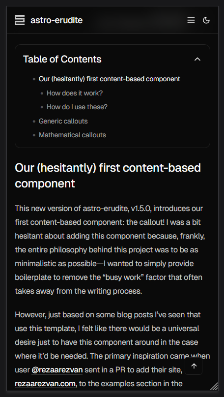
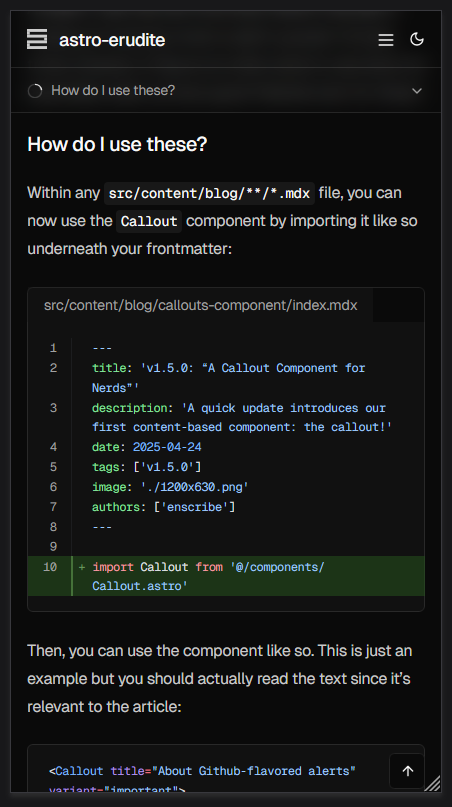
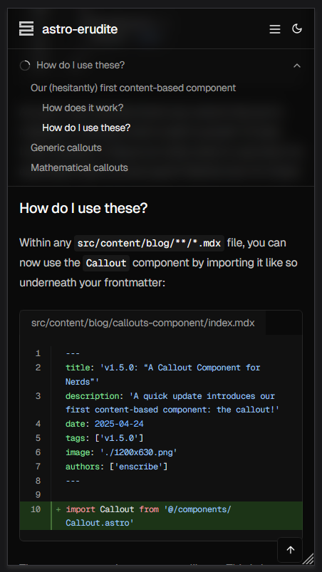
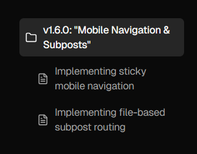
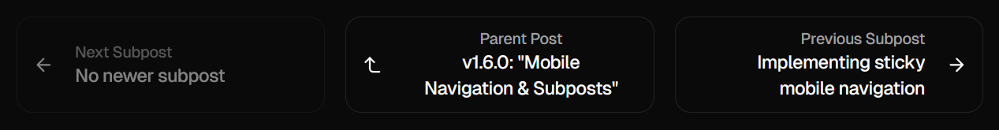

## Two major improvements to the reading experience

astro-erudite's v1.6.0 brings about two significant enhancements that I've been wanting to implement for quite some time! The first addresses a longstanding mobile <abbr title="User Experience">UX</abbr> issue, while the second introduces a content organization paradigm that I find interesting.

### Mobile navigation

The original table of contents implementation was frankly inadequate for mobile users. While desktop users enjoyed a beautiful sticky sidebar with scroll-aware highlighting, mobile users were stuck with a basic collapsible `<details>{:html}` element that provided no indication of reading progress or current location within the post:

<div class="max-w-xs mx-auto">

</div>

The new mobile navigation system introduces a sticky header that sits just below the main site navigation, featuring a circular progress indicator and dynamic section display. As you scroll through a post, the progress circle fills to show how far you've read, while the text updates to reflect which section you're currently viewing. Tapping on this header expands a comprehensive table of contents that mirrors the desktop experience but in a mobile-friendly format:

<div class="flex gap-4 flex-wrap justify-center [&_img,p]:m-0">
  <div class="max-w-xs">
    
  </div>
  <div class="max-w-xs">
    
  </div>
</div>

This gives users the same level of navigation control as if they were on desktop, in a very intuitive and mobile-friendly format.

### Subposts for hierarchical content organization

The second major feature is something I'm calling "subposts," a way to organize related content in a parent-child hierarchy within your blog. This concept came from when I was writing [this](https://enscribe.dev/blog/japan-retrospective) travel blog post on my personal site, where I essentially wanted a "subpost" for each day of the trip since it was way too long to fit into a single post.

Instead of creating separate blog posts in a "series" (and thus clogging up your blog post listings with a bunch of smaller, tangentially-related posts), you can now automatically establish a parent-child relationship between posts by creating a folder for your main topic with an `index.mdx` file as your parent post, then adding additional `.mdx` files in the same folder as subposts. For example, this very post demonstrates the feature by containing two subposts that explore the technical implementation details of each feature. On desktop, we display a `<SubpostsSidebar>{:tsx}` component on the right-hand side of the page that shows a list of all the subposts alongside the parent post:

<div class="flex gap-4 flex-wrap justify-center [&_img,p,.expressive-code]:m-0">
  <div class="max-w-3xs border">
    
  </div>
  <div class="max-w-3xs">

```bash showLineNumbers={false}
src/
  content/
    blog/
      mobile-nav-and-subposts/
        index.mdx
        mobile-navigation.mdx
        subposts.mdx
```

  </div>
</div>

The file structure is intuitive: create a folder for your main topic with an `index.mdx` file as your parent post, then add additional `.mdx` files in the same folder as subposts. Astro's file-based routing handles the URL structure automatically, creating paths like `/blog/subposts` for the parent post and `/blog/subposts/mobile-navigation` and `/blog/subposts/subposts` for the subposts.

#### Enhanced navigation patterns

Of course, we need to adjust our `<PostNavigation>{:tsx}` component to support this new feature. Now, whenever we're reading a subpost, we now have the option to traverse between subposts or even upwards to the parent post:

<div class="border [&_img,p]:m-0">

</div>

This is contextually aware, meaning that if you're reading a parent post (or a post with no children), then this component will only show adjacent parent-level posts.

#### Hint: this is great for technical content

The subposts feature particularly shines for technical content which is meant to educate. In a similar manner to a tutorial or a textbook, we can now fragment our content into more digestible and informative subposts which are easily traversable between each other and from the parent post, and the reader is now free to jump around to whichever subpost they're interested in.

This post itself serves as an example, since you're currently reading the parent post (which I've called the "Index" post in the `<Breadcrumb>{:tsx}` component) and the subposts are the two posts that I've written about the technical implementation details of each feature.

What's great about the way I engineered subposts is that it's fully backwards-compatible with blog posts written before this, so there's no need to define extra frontmatter metadata or manually establish the parent-child relationships between posts. It serves lovely on the <abbr title="Developer Experience">DX</abbr> side as well!

## Go ahead and read the subposts

On desktop, the `<SubpostsSidebar>{:tsx}` sticks to the right column on your screen, and you can click on any of the subposts to read them. On mobile, it will turn into a `<SubpostsHeader>{:tsx}` component that will appear underneath the sticky header, above the sticky table of contents we just added.