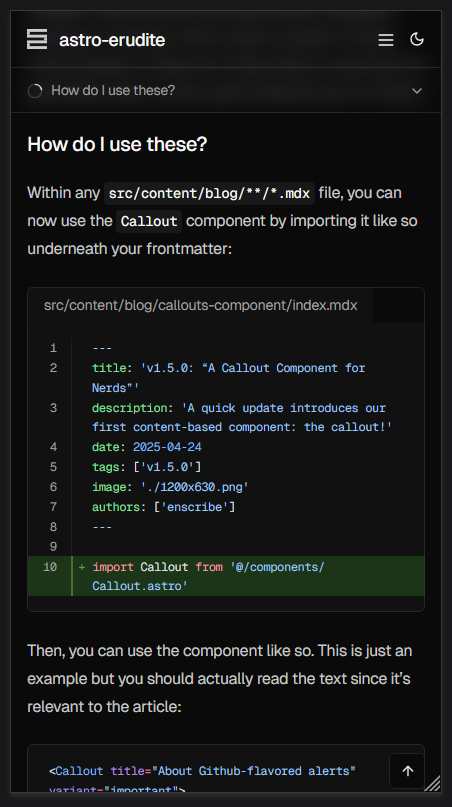

## Two major improvements to the reading experience

astro-erudite's v1.6.0 brings about two significant enhancements that I've been wanting to implement for quite some time! The first addresses a longstanding mobile <abbr title="User Experience">UX</abbr> issue, while the second introduces a content organization paradigm that I find interesting.

### Mobile navigation

The original table of contents implementation was frankly inadequate for mobile users. While desktop users enjoyed a beautiful sticky sidebar with scroll-aware highlighting, mobile users were stuck with a basic collapsible `<details>{:html}` element that provided no indication of reading progress or current location within the post:


The new mobile navigation system introduces a sticky header that sits just below the main site navigation, featuring a circular progress indicator and dynamic section display. As you scroll through a post, the progress circle fills to show how far you've read, while the text updates to reflect which section you're currently viewing. Tapping on this header expands a comprehensive table of contents that mirrors the desktop experience but in a mobile-friendly format:




This gives users the same level of navigation control as if they were on desktop, in a very intuitive and mobile-friendly format.

### Subposts for hierarchical content organization

The second major feature is something I'm calling "subposts," a way to organize related content in a parent-child hierarchy within your blog. This concept came from when I was writing [this](https://enscribe.dev/blog/japan-retrospective) travel blog post on my personal site, where I essentially wanted a "subpost" for each day of the trip since it was way too long to fit into a single post.

Instead of creating separate blog posts in a "series" (and thus clogging up your blog post listings with a bunch of smaller, tangentially-related posts), you can now automatically establish a parent-child relationship between posts by creating a folder for your main topic with an `index.mdx` file as your parent post, then adding additional `.mdx` files in the same folder as subposts. For example, this very post demonstrates the feature by containing two subposts that explore the technical implementation details of each feature. On desktop, we display a `<SubpostsSidebar>{:tsx}` component on the right-hand side of the page that shows a list of all the subposts alongside the parent post:


```bash
src/
  content/
    blog/
      mobile-nav-and-subposts/
        index.mdx
        mobile-navigation.mdx
        subposts.mdx
```

The file structure is intuitive: create a folder for your main topic with an `index.mdx` file as your parent post, then add additional `.mdx` files in the same folder as subposts. Astro's file-based routing handles the URL structure automatically, creating paths like `/blog/subposts` for the parent post and `/blog/subposts/mobile-navigation` and `/blog/subposts/subposts` for the subposts.

#### Enhanced navigation patterns

Of course, we need to adjust our `<PostNavigation>{:tsx}` component to support this new feature. Now, whenever we're reading a subpost, we now have the option to traverse between subposts or even upwards to the parent post:


This is contextually aware, meaning that if you're reading a parent post (or a post with no children), then this component will only show adjacent parent-level posts.

#### Hint: this is great for technical content

The subposts feature particularly shines for technical content which is meant to educate. In a similar manner to a tutorial or a textbook, we can now fragment our content into more digestible and informative subposts which are easily traversable between each other and from the parent post, and the reader is now free to jump around to whichever subpost they're interested in.

This post itself serves as an example, since you're currently reading the parent post (which I've called the "Index" post in the `<Breadcrumb>{:tsx}` component) and the subposts are the two posts that I've written about the technical implementation details of each feature.

What's great about the way I engineered subposts is that it's fully backwards-compatible with blog posts written before this, so there's no need to define extra frontmatter metadata or manually establish the parent-child relationships between posts. It serves lovely on the <abbr title="Developer Experience">DX</abbr> side as well!

## Go ahead and read the subposts

On desktop, the `<SubpostsSidebar>{:tsx}` sticks to the right column on your screen, and you can click on any of the subposts to read them. On mobile, it will turn into a `<SubpostsHeader>{:tsx}` component that will appear underneath the sticky header, above the sticky table of contents we just added.

## Implementing sticky mobile navigation

The original mobile table of contents was a simple collapsible element that lived within the post content. This created several usability issues:
1. Users had no sense of how much content remained other than implying it based on the length of the browser scrollbar
2. Once you scrolled past the TOC, you lose the ability to quickly navigate to other sections of the post without scrolling back up to the inline TOC
3. Mobile users should have the exact same experience as desktop users in terms of navigation, and as of now the desktop experience was better (due to the sticky aside TOC)

### Building the sticky header system

Design-wise, the component is relatively simple, since it only includes a chevron to indicate expansion state, a circular progress indicator that fills as you scroll, and a dynamic text showing the current section (or a combination of sections, if multiple are visible at the same time).

#### Live scroll highlighting sucks

One of the more interesting problems I encountered was how to handle the highlighting of sections as you scroll. Of course, this applies to both mobile and desktop versions, but in this update I changed the implementation of both.

A naive implementation of live scroll highlighting would simply use an `IntersectionObserver(){:js}` to watch for headers entering and exiting the viewport. The issue with this is that it doesn't highlight anything if headers are no longer visible in your viewport, regardless of whether you're in a section that "belongs" to a heading.

:::note[Example]
Say that we have a post with the following structure:

```markdown
## Part 1
[500 lines of content]

## Part 2
[500 lines of content]
```

If you were to scroll way past the first heading and was deep into the first section underneath it, the naive implementation would not highlight the first heading because it's no longer in your viewport. This is unintuitive and a poor user experience. In a perfect world, if we were to view 250 lines of Part 1 and 250 lines of Part 2, then we would see both headings highlighted in the TOC and not need to make a decision about which heading to highlight.
:::

I used to rely on [jakelow/remark-sectionize](https://github.com/jake-low/remark-sectionize), a [remarkjs/remark](https://github.com/remarkjs/remark) plugin that retroactively generates `<section>{:html}` tags based on the headers in the generated HTML. This would have done the following conversion:

```markdown
# Forest elephants

## Introduction

In this section, we discuss the lesser known forest elephants.

## Habitat

Forest elephants do not live in trees but among them.
```

```html
<section>
  <h1>Forest elephants</h1>
  <section>
    <h2>Introduction</h2>
    <p>In this section, we discuss the lesser known forest elephants.</p>
  </section>
  <section>
    <h2>Habitat</h2>
    <p>Forest elephants do not live in trees but among them.</p>
  </section>
</section>
```

However, this approach had pretty complicated issues involving section nesting and the fact that we didn't have any control over its output other than by patching it. So, I decided to opt for a home-grown solution.

#### The concept of "jurisdictions"

The naming is interesting but I felt like it was the most intuitive to me. Basically, I created a system that assigns each heading a "territory" that extends from its position to the start of the next heading (or the end of the document):

```javascript title="src/components/TOCHeader.astro" startLineNumber=123
function buildHeadingJurisdictions() {
  headingElements = Array.from(
    document.querySelectorAll('.prose h2, .prose h3, .prose h4, .prose h5, .prose h6')
  )
  
  jurisdictions = headingElements.map((heading, index) => {
    const nextHeading = headingElements[index + 1]
    return {
      id: heading.id,
      start: heading.offsetTop,
      end: nextHeading ? nextHeading.offsetTop : document.body.scrollHeight
    }
  })
}
```

1. First, we collect all heading elements (`<h2>{:html}` through `<h6>{:html}`) from the document's prose content area using `.querySelectorAll(){:js}`.
2. For each heading, we create a jurisdiction object that contains the heading's `id`, the vertical position where this section begins (the heading's `offsetTop` value, which we name `start`), and the vertical position where this section ends (the `offsetTop` of the next heading or the bottom of the document if it's the last heading, which we name `end`).

This creates a map of "territories" that each heading controls. This is crucial for accurately tracking which jurisdictions are currently visible as the user scrolls, even when the actual heading element itself is no longer in view.

#### The decision to show all visible sections

One of the more interesting decisions I made was to display all sections as comma-separated within the mobile TOC's unexpanded state. This manifests as follows:

:::note[Example]
Recall the previous example's scenario:
```markdown
## Part 1
[500 lines of content]

## Part 2
[500 lines of content]
```
If we saw 250 lines of Part 1 and 250 lines of Part 2, then the text snippet in the mobile TOC would read "Part 1, Part 2".
:::

The temptation is to implement a "smart" selection algorithm, perhaps showing the section with the most visible content, or the one closest to the viewport center, or to show the "deepest," most specifically nested section. However, this creates numerous edge cases:

1. If you click to navigate to a short final section, it might never become the "primary" section because there isn't enough content below it to scroll it to the top of the viewport.

2. As you scroll between sections, a "smart" selector might switch which section it considers primary at seemingly arbitrary points, creating a jarring experience.

3. When your viewport shows roughly equal amounts of two sections, any selection algorithm becomes essentially arbitrary.

By showing all visible sections, we give users complete awareness of their position in the document, eliminate the edge cases mentioned above, and create predictable behavior.

### Progress indicator implementation

The circular progress indicator provides immediate visual feedback about reading progress without requiring any interaction:

```javascript title="src/components/TOCHeader.astro" startLineNumber=216
  function updateProgressCircle() {
    if (!progressCircleElement) return
    const scrollableDistance =
      document.documentElement.scrollHeight - window.innerHeight
    const scrollProgress =
      scrollableDistance > 0
        ? Math.min(Math.max(window.scrollY / scrollableDistance, 0), 1)
        : 0
    progressCircleElement.style.strokeDashoffset = (
      PROGRESS_CIRCLE_CIRCUMFERENCE *
      (1 - scrollProgress)
    ).toString()
  }
```

The progress is calculated as a ratio of current scroll position to total scrollable distance, then applied as a stroke-dashoffset to create the filling effect.

## Implementing file-based subpost routing

The subposts feature leverages Astro's file-based routing to automatically detect parent-child relationships without any configuration. The entire implementation hinges on a simple observation: if a post ID contains a forward slash, it's a subpost.

```typescript title="src/lib/data-utils.ts" startLineNumber=161
export function isSubpost(postId: string): boolean {
  return postId.includes('/')
}

export function getParentId(subpostId: string): string {
  return subpostId.split('/')[0]
}
```

This is a pretty elegant solution which requires no frontmatter configuration, no manual relationship mapping, and zero migration effort for existing posts.

### Navigation complexity

One of the more intricate parts of this update was rethinking navigation. The original `getAdjacentPosts(){:ts}` function assumed simple previous/next relationships. With subposts, we now have three distinct navigation contexts:

:::note[Example]
Consider this structure:
```
blog/
  getting-started.mdx
  react-tutorial/
    index.mdx
    components.mdx
    state.mdx
  advanced-patterns.mdx
```

Navigation depends on context:
- From `getting-started.mdx`: next goes to `react-tutorial/index.mdx`
- From `react-tutorial/components.mdx`: next goes to `state.mdx`, previous to `index.mdx`
- From `react-tutorial/state.mdx`: previous goes to `components.mdx`, parent goes to `index.mdx`
:::

Here's how we handle this complexity:

```typescript title="src/lib/data-utils.ts" startLineNumber=40
export async function getAdjacentPosts(currentId: string): Promise<{
  newer: CollectionEntry<'blog'> | null
  older: CollectionEntry<'blog'> | null
  parent: CollectionEntry<'blog'> | null
}> {
  const allPosts = await getAllPosts()

  if (isSubpost(currentId)) {
    const parentId = getParentId(currentId)
    const parent = allPosts.find((post) => post.id === parentId) || null

    // Get all sibling subposts
    const posts = await getCollection('blog')
    const subposts = posts
      .filter(
        (post) =>
          isSubpost(post.id) &&
          getParentId(post.id) === parentId &&
          !post.data.draft
      )
      .sort((a, b) => a.data.date.valueOf() - b.data.date.valueOf())

    const currentIndex = subposts.findIndex((post) => post.id === currentId)
    
    return {
      newer: currentIndex < subposts.length - 1 
        ? subposts[currentIndex + 1] 
        : null,
      older: currentIndex > 0 
        ? subposts[currentIndex - 1] 
        : null,
      parent,
    }
  }

  // For parent posts, only navigate among other parent-level posts
  const parentPosts = allPosts.filter((post) => !isSubpost(post.id))
  const currentIndex = parentPosts.findIndex((post) => post.id === currentId)

  return {
    newer: currentIndex > 0 ? parentPosts[currentIndex - 1] : null,
    older: currentIndex < parentPosts.length - 1 
      ? parentPosts[currentIndex + 1] 
      : null,
    parent: null,
  }
}
```

As a TL;DR, subposts should only navigate among siblings and should be able to go up to their parent, while parent posts should only navigate among other parent-level posts.

### Other considerations

- The breadcrumb component required careful thought to handle three distinct cases:

    ```astro title="src/pages/blog/[...id].astro" startLineNumber=70
    <Breadcrumbs
      items={[
        { href: '/blog', label: 'Blog', icon: 'lucide:library-big' },
        ...(isCurrentSubpost && parentPost
          ? [
              {
                href: `/blog/${parentPost.id}`,
                label: parentPost.data.title,
                icon: 'lucide:book-open',
              },
              {
                href: `/blog/${currentPostId}`,
                label: post.data.title,
                icon: 'lucide:file-text',
              },
            ]
          : [
              {
                href: `/blog/${currentPostId}`,
                label: post.data.title,
                icon: 'lucide:book-open-text',
              },
            ]),
      ]}
    />
    ```

    We append `-text` to `book-open` or `file` (for parent posts and subposts, respectively) to indicate the active post by differentiating it from inactive icons which would lack the text within the icon.

- The main blog listing (alongside other listings, e.g. filtering by tags, filtering by author) should exclude subposts to avoid cluttering the feed:

    ```typescript title="src/lib/data-utils.ts" startLineNumber=7
    export async function getAllPosts(): Promise<CollectionEntry<'blog'>[]> {
    const posts = await getCollection('blog')
    return posts
        .filter((post) => !post.data.draft && !isSubpost(post.id))
        .sort((a, b) => b.data.date.valueOf() - a.data.date.valueOf())
    }
    ```

    Without this filter, your blog listing would show every subpost as a top-level entry, defeating the purpose of hierarchical organization.

- Desktop and mobile require fundamentally different approaches for displaying the subpost hierarchy. On desktop, we have the luxury of a persistent sidebar. On mobile, screen real estate demands integration with the sticky header system. This required careful slot management in the top-level `Layout.astro`:

    ```astro title="src/layouts/Layout.astro"
    <div class="bg-background/50 sticky top-0 z-50 border-b backdrop-blur-sm">
        <Header />
        <slot name="subposts-navigation" />
        <slot name="table-of-contents" />
    </div>
    ```

    The order is semantic here since subposts navigation comes before table of contents, creating a logical hierarchy of navigation options from broad (which post/subpost) to specific (which section).

- Not much testing has been done for deep nesting but my assumption is that it shouldn't work. This is intentional to maintain simplicity, since at that point you might as well use a documentation site rather than a blogging site.
